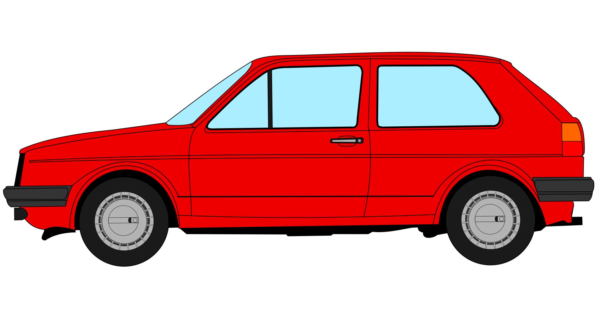

# 👋 Hi, I’m @BrayanOfficiel

## About Me 
- 🏫 Student at **IIM Digital School**
- 💻 Interested in **coding** 💻, **pre-2000 cars** , and **tuning** 🔧
- 📚 Currently learning **Symfony**

## Skills

## Contact Me
- 📧 Email: [Contact me here !](mailto:haider-rayan.boudjemeline@edu.devinci.fr)
